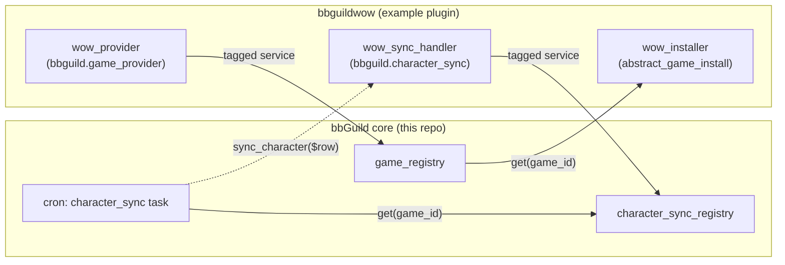
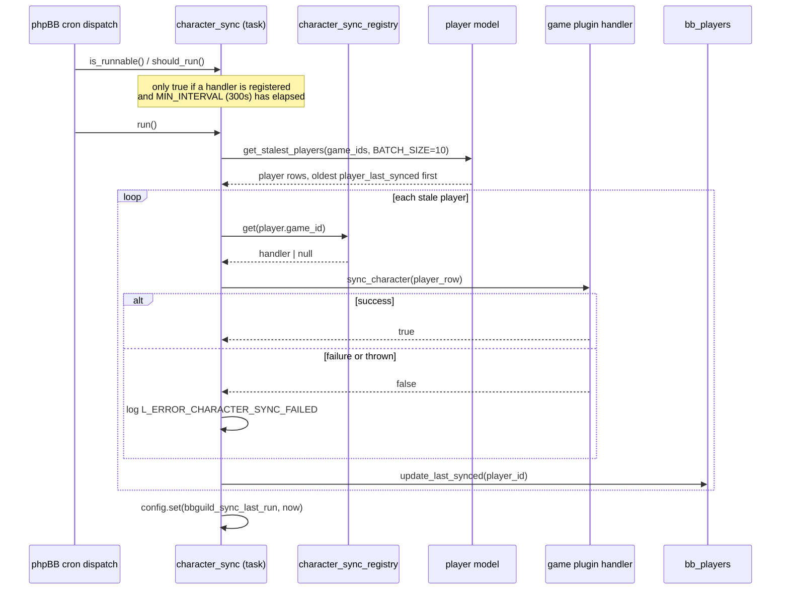

# bbGuild Architecture

## Overview

bbGuild is a guild management extension for phpBB 3.3+. It provides guild
roster management, character tracking, recruitment, a Message-of-the-Day /
news system, and a tabbed portal page — with game-specific behavior (class
data, race data, Battle.net-style APIs, character sync) supplied by separate
"game plugin" extensions rather than built into core.

- **Vendor namespace:** `avathar\bbguild`
- **Entry point:** `ext.php`
- **Requirements:** PHP >= 8.1, phpBB >= 3.3, GD, cURL
- **Version:** tracked in the `ext::BBGUILD_VERSION` class constant, not
  `phpbb_config` — see [Design decisions](#design-decisions-and-rationale)

This document is a working architecture reference, not a full arc42 spec —
it covers system context, component boundaries, the design decisions worth
remembering the reasoning behind, and the cross-cutting rules that apply
across the codebase. For column-level database detail, see
[`contrib/database.md`](database.md).

## System Context

bbGuild core is a standard phpBB 3.3 extension: it registers routes,
controllers, ACP/UCP modules, an event listener, and a cron task through
phpBB's dependency-injection container (`config/services.yml`), and ships
its schema as a chain of `phpbb\db\migration` classes. `ext.php` extends
`phpbb\extension\base` and gates enablement on PHP/phpBB version and the
`gd`/`curl` extensions (`is_enableable()`); it also auto-disables known
child extensions before core disables (`disable_step()`), since a child's
`services.yml` references core-defined DI parameters that stop existing
once core is gone — though its hardcoded child list is currently stale
(see [Known Gaps](#known-gaps--deliberately-out-of-scope)).

**Game plugins** — `bbguildwow`, `bbguildgw2`, `bbguildlotro`, `bbguildeq`,
`bbguildeq2`, `bbguildffxi`, `bbguildffxiv`, `bbguildswtor`,
`bbguildlineage2` — are themselves separate phpBB extensions living at
`ext/avathar/bbguild<game>/` (no separator: phpBB's extension class loader
can't handle a hyphenated directory name, and EPV rejects underscores in a
composer package name — that's why the family dropped the `bbguild_<game>`
naming in 2.0.0-b4). Each plugin:

- Depends on core through **two independent, deliberately loose-coupled
  mechanisms** — a hard runtime gate and an advisory packaging hint:
  - A hard version gate in its own `ext.php::is_enableable()`: it reads
    `avathar\bbguild\ext::BBGUILD_VERSION` and refuses to enable if core is
    older than its own `MIN_BBGUILD_VERSION` constant (e.g. `bbguildwow`
    currently requires `>=2.0.0`). This is the check that's actually
    enforced.
  - A `composer.json` `"suggest"`/soft-require line naming the same
    minimum version, which is advisory only — Composer doesn't enforce it
    the way a hard `require` would, since these packages aren't installed
    through Composer's dependency resolver in a typical phpBB deployment.
  - Migration `depends_on()` chains are **not** used as a version gate —
    they intentionally pin to whatever core migration first introduced the
    schema the plugin actually needs (a correctness dependency), not to the
    current release. Bumping the version gate and bumping the schema
    dependency are two separate concerns kept in two separate places.
- Registers a **game provider** (`game_provider_interface`) tagged
  `bbguild.game_provider` in its own `config/services.yml`, giving core
  the game's display name, boss/zone URL formats, armor types, regions,
  and (if it has one) an API client (`game_api_interface`).
- Optionally registers a **character-sync handler**
  (`character_sync_interface`) tagged `bbguild.character_sync`, letting
  core's scheduled cron task delegate syncing an individual character back
  to the plugin that knows how to fetch its data.
- Provides a `game_install_interface` implementation (extending core's
  `abstract_game_install`) that seeds factions/classes/races/roles/specs
  into the shared reference tables (`bb_factions`, `bb_classes`, `bb_races`,
  `bb_gameroles`, `bb_specializations`) on demand from ACP — game data is
  **not** migrated in; it's installed interactively, same as the built-in
  "Custom" game (`model/games/library/install_custom.php`).

Both tag collections use `phpbb\di\service_collection` (see
[Design decisions](#design-decisions-and-rationale) for why, not Symfony's
`!tagged_iterator`), wrapped by a thin core registry —
`game_registry`/`character_sync_registry` — that indexes providers/handlers
by `game_id` for O(1) lookup.



## Component View

### Directory structure

```
bbguild/
├── acp/                    # ACP module definitions (*_info.php + *_module.php)
├── config/                 # DI services, routing, table parameters (YAML)
├── controller/              # Request controllers (ACP + frontend)
├── cron/                   # Cron tasks (character_sync)
├── event/                  # phpBB event listeners
├── language/               # Localization (en, de, fr, it, nl, es_x_tu, pl)
├── migrations/              # Database migrations (see contrib/database.md)
├── model/                   # Business logic and data access
│   ├── admin/               # Utilities: curl, log, constants, util, asset_url_resolver
│   ├── api/                 # Game API client abstraction (e.g. Battle.net)
│   ├── games/                # Game registry, character-sync registry, abstract installer
│   │   └── rpg/               # Classes/races/roles/factions/specialization CRUD
│   └── player/               # Player, guild, rank, recruitment models
├── portal/                  # Portal block engine + guild context
│   └── modules/               # Module infrastructure + built-in modules
├── styles/                  # Twig templates (prosilver)
├── ucp/                     # User Control Panel modules
├── images/                  # UI assets (emblems, icons, progressbar)
├── contrib/                 # Documentation, diagrams, changelog
└── tests/                   # Unit tests
```

### Frontend template structure

```
main.html
├── Guild header (name, faction, realm, member count, emblem)
├── Tab bar (from bb_portal_tabs, #360)
└── view/welcome.html (portal renderer, active tab only)
    ├── portal-top (modules_top loop)
    ├── portal-content-wrapper
    │   ├── portal-right (modules_right loop)
    │   │   └── recruitment_side.html, custom blocks, etc.
    │   └── portal-center (modules_center loop)
    │       ├── motd_center.html
    │       ├── roster_center.html (filters, table, pagination)
    │       └── news_center.html, statistics, activity, etc.
    └── portal-bottom (modules_bottom loop)
```

### Service layer

All services are defined in `config/services.yml` and
`config/portal_services.yml`; table names are parameterised in
`config/tables.yml`.

| Service ID | Class | Purpose |
|---|---|---|
| `avathar.bbguild.controller` | `controller\view_controller` | Frontend routes (guild page) |
| `avathar.bbguild.admin.main` | `controller\admin_main` | ACP dashboard, settings, logs |
| `avathar.bbguild.admin.games` | `controller\admin_games` | Game/faction/race/class/role management |
| `avathar.bbguild.admin.guild` | `controller\admin_guild` | Guild/rank/player management |
| `avathar.bbguild.admin.portal` | `controller\admin_portal` | Portal module/tab management |
| `avathar.bbguild.log` | `model\admin\log` | bbGuild activity log |
| `avathar.bbguild.curl` | `model\admin\curl` | HTTP client wrapper |
| `avathar.bbguild.util` | `model\admin\util` | Request utilities |
| `avathar.bbguild.game_registry` | `model\games\game_registry` | Game provider lookup |
| `avathar.bbguild.character_sync_registry` | `model\games\character_sync_registry` | Character-sync handler lookup |
| `avathar.bbguild.cron.task.character_sync` | `cron\task\character_sync` | Scheduled character-sync task (#361) |
| `avathar.bbguild.listener` | `event\main_listener` | phpBB event hooks |

Portal services (`config/portal_services.yml`):

| Service ID | Class | Purpose |
|---|---|---|
| `avathar.bbguild.guild_context` | `portal\guild_context` | Resolves guild, loads data, assigns header template vars |
| `avathar.bbguild.portal.renderer` | `portal\portal_renderer` | Renders the active tab's layout for a guild |
| `avathar.bbguild.portal.columns` | `portal\columns` | Column constants and helpers |
| `avathar.bbguild.portal.module_helper` | `portal\module_helper` | Module rendering helper (template, language, columns) |
| `avathar.bbguild.portal.module_registry` | `portal\module_registry` | Available module type lookup |
| `avathar.bbguild.portal.modules.manager` | `portal\modules\manager` | Module CRUD operations |
| `avathar.bbguild.portal.modules.database_handler` | `portal\modules\database_handler` | Module + tab layout persistence |

Built-in portal modules (tagged `bbguild.portal.module`):
- `avathar.bbguild.portal.module.motd` — Message of the Day
- `avathar.bbguild.portal.module.recruitment` — Recruitment status
- `avathar.bbguild.portal.module.roster` — Guild roster (center-only, grid/listing layout switcher, filters, pagination)
- `avathar.bbguild.portal.module.statistics` — Guild statistics (guild/race/rank breakdowns)

### Routes

Defined in `config/routing.yml`:

| Route | Path | Controller |
|---|---|---|
| `avathar_bbguild_guild` | `/guild/{guild_id}` | `view_controller::handleview` |
| `avathar_bbguild_00` | `/guild/{page}/{guild_id}` | `view_controller::handleview` (`$page` doubles as the initial tab slug) |
| `avathar_bbguild_player` | `/guild/{guild_id}/player/{player_id}/{tab_slug}` | `view_controller::playerdetail` (`$tab_slug` is an optional trailing segment, defaulting to empty, which resolves to the Character tab) |
| `avathar_bbguild_01` | `/getfaction` | AJAX: faction selector |
| `avathar_bbguild_02` | `/getguildrank/{guild_id}` | AJAX: rank selector |
| `avathar_bbguild_03` | `/getplayerList/{game_id}` | AJAX: player list |
| `avathar_bbguild_04` | `/getclassrace/{game_id}` | AJAX: class/race selector |

### ACP modules

The bbGuild ACP category (`ACP_CAT_BBGUILD`) has three sub-categories. The
base tree is registered in `migrations/v200b3/release_2_0_0_b3.php`; the
**Game settings** category was added in
`migrations/v200rc4/release_2_0_0_rc4.php`, which also moved the Game List
module into it and positions the category right after General Settings.

| Sub-category (langname → title) | Module (`acp/*_module.php`) | Controller | Modes |
|---|---|---|---|
| `ACP_BBGUILD_MAINPAGE` → General Settings | `main_module` | `admin_main` | panel (Dashboard), config (Settings), logs (Activity Log) |
| `ACP_BBGUILD_GAMESETTINGS` → Game settings | `game_module` | `admin_games` | listgames, editgames, addfaction, addrace, addclass, addrole |
| `ACP_BBGUILD_PLAYER` → Guild and Player management | `guild_module` | `admin_guild` | addguild, editguild, listguilds |
| `ACP_BBGUILD_PLAYER` → Guild and Player management | `player_module` | `admin_guild` | addplayer, listplayers |

Notes:
- **Portal management** is not a standalone ACP module — it is a tab on
  the guild-edit page (`admin_guild::show_editguildportal`, delegating to
  `admin_portal`), which now also owns tab CRUD (#360).
- **Game plugins register their own ACP modules into these categories.**
  For example `bbguildwow` adds `battlenet_module` (BattleNet API) under
  **Game settings** and `achievement_module` under **Guild and Player
  management** (its migrations `depends_on` the core migration that owns
  the target category).

### Game plugins

| Plugin | Game | API |
|---|---|---|
| `bbguildwow` | World of Warcraft | Battle.net |
| `bbguildgw2` | Guild Wars 2 | - (GW2 API v2 in progress) |
| `bbguildlotro` | Lord of the Rings Online | - |
| `bbguildeq` | EverQuest | - |
| `bbguildeq2` | EverQuest 2 | - |
| `bbguildffxi` | Final Fantasy XI | - |
| `bbguildffxiv` | Final Fantasy XIV | fragile third-party parsers |
| `bbguildswtor` | Star Wars: The Old Republic | - |
| `bbguildlineage2` | Lineage 2 | - |

A built-in "Custom" game ships in core itself
(`model/games/library/install_custom.php`) for boards not tied to a
specific supported title.

In practice, **8 of the 9 game plugins are pure data-seeding plugins**:
just a `game/<game>_provider.php` + `game/<game>_installer.php` pair (no
`src/`, controllers, entities, or new DB tables), seeding rows into core's
shared `bb_classes`/`bb_races`/`bb_factions`/`bb_language`/
`bb_specializations` tables. `bbguildwow` is the sole exception and is
treated as the reference implementation for what a full-featured plugin
looks like — it alone has its own API client, cron sync, ACP modules,
achievements, and an avatar driver (see `bbguildwow/docs/ARCHITECTURE.md`).
Plugins whose game has no named "build/spec" layer above their class list
(eq, eq2, ffxi, ffxiv, lineage2) ship an intentionally empty
`spec_catalog()` with a documented rationale rather than fabricated data —
this is a deliberate modeling decision per plugin, not missing work.

### Log system

`model/admin/log.php` follows phpBB core's own log design: each entry
stores a `log_type` (a language key, e.g. `L_ACTION_GUILD_ADDED`) and
`log_action` (a `json_decode`-able array of `vsprintf` substitution args —
switched from PHP `unserialize` during the EPV CI hardening pass). The log
viewer resolves the language key and applies the args via `vsprintf()` at
render time; `ACTION_*` keys are short labels, `VLOG_*` keys are verbose
format strings whose first `%s` is always the username resolved from
`log_userid`. Valid types are enumerated in `log::$valid_action_types`.

### Module responsibilities and dependencies

| Directory | Owns | Depends on |
|---|---|---|
| `controller/` | Frontend route handler (`view_controller`) and the four ACP controllers (`admin_main`, `admin_games`, `admin_guild`, `admin_portal`); AJAX endpoints (`ajax_controller`); shared input validation (`validator`) | `model/`, `portal/` (frontend), phpBB DI services |
| `model/` | Business logic and data access: `player/` (player, guild, rank, recruitment queries), `games/` (provider/installer/registry interfaces and the game_registry/character_sync_registry DI wiring), `games/rpg/` (classes/races/roles/factions/specialization CRUD), `admin/` (curl client, activity log, request-parsing `util`, asset URL resolver), `api/` (Battle.net-style API client abstraction) | phpBB `dbal`, `config`, `cache` services |
| `portal/` | The portal rendering engine: `guild_context` (resolves the active guild + header vars), `portal_renderer` (resolves the active tab, assembles enabled modules per column), `columns`/`module_helper`/`module_registry`, and `modules/` (module CRUD `manager`, `database_handler` for layout/config persistence, `module_interface`/`module_base`, and the built-in modules themselves: MOTD, Roster, Recruitment, Statistics) | `model/` for data, phpBB `template` |
| `event/` | `main_listener`, the single `EventSubscriberInterface` implementation: assigns a global template flag on every page (`core.common`), registers bbGuild's language sets (`core.user_setup`), adds the guild-picker link to the page header (`core.page_header`), and registers the `bbguild` permission category (`core.permissions`) | phpBB core events only |
| `migrations/` | Schema, seed data, config keys, permissions, and ACP/UCP module registration, as a chain of milestone-named migration classes (`v200b3` → `v210b2`, see `contrib/database.md`) | phpBB migrator; each migration `depends_on()` the previous |
| `acp/` | ACP module glue: an `*_info.php` (menu registration) + `*_module.php` (mode dispatch) pair per category, delegating the actual work to the matching `controller/admin_*.php` | `controller/`, phpBB `module.manager` |
| `ucp/` | The single UCP module (`bbguild_module`): character claim/add/update/delete for the logged-in user | `model/player/` |
| `cron/` | `task/character_sync.php` — the scheduled task described under [character-sync](#character-sync-scheduler-361) below | `model/games/character_sync_registry`, `model/player/player` |

Dependency direction is consistently controller/portal/cron → model → phpBB
core services; `model/` and `portal/` don't call back into `controller/`.
The one historical exception — `portal`'s `guild_context` used to be
constructed inline by `view_controller` — was fixed by making it a DI
service (`avathar.bbguild.guild_context`) instead of `view_controller`
passing itself around as a service locator (see `CLAUDE.md`'s "#346" fix).

### Frontend request flow

1. `view_controller::handleview()` receives the request for
   `/guild/{guild_id}` (or the legacy `/guild/{page}/{guild_id}` route,
   where `$page` doubles as the initial tab slug).
2. `guild_context` resolves the guild by ID, loads guild data, and assigns
   header/dropdown template vars.
3. `portal_renderer::render()` resolves the active tab (from the URL slug,
   falling back to the guild's lowest-`tab_order` tab), loads that tab's
   enabled modules from `database_handler`, and assigns each into its
   column's template loop (top/center/right/bottom).
4. `main.html` renders the guild header plus `view/welcome.html` (the
   portal template), which renders the tab bar and each column's modules.

There's no separate "roster page" or "news page" template — the roster,
news, MOTD, and recruitment views are all portal modules rendered inline on
whichever tab an ACP admin places them on.

## Design Decisions and Rationale

**Portal tabs on top of columns (#360).** The portal originally had a
single implicit page per guild, organized into four columns
(top/center/right/bottom) via `bb_portal_modules.module_column` +
`module_order`. #360 added `bb_portal_tabs` and a `module_tab` column
scoping each module to a tab, so a guild can have multiple pages (e.g.
"Overview", "Roster", "Rules") each with their own independent column
layout — rather than building a second, parallel page-routing mechanism,
tabs were layered onto the existing column engine by adding one more
scoping key. The migration backfills exactly one "Overview"/`welcome` tab
per existing `guild_id`, so upgrading is a zero-visible-change no-op until
an admin adds a second tab.

**Character-sync scheduler contract (#361).** Before #361, keeping
character data current in the source game was entirely manual (an admin or
the player re-triggering a fetch). #361 added a core-owned cron task
(`cron/task/character_sync.php`) that periodically picks a small batch of
the stalest characters (by `player_last_synced`) across every game that has
*registered a sync handler*, and delegates the actual fetch back to that
game's own plugin via `character_sync_interface`. Core deliberately knows
nothing about how any individual game's sync works — it only knows the
contract (`get_game_id()`, `sync_character(array $player_row): bool`) and
the registry that maps `game_id → handler`. This makes character sync an
extension point the same shape as the existing game-provider pattern,
rather than a WoW-specific feature bolted onto core.



The task is deliberately careful about when it builds a `player` instance:
phpBB's cron dispatch eagerly instantiates every registered `cron.task`
service roughly once a minute just to check `is_runnable()`/`should_run()`,
regardless of readiness — `player`'s constructor unconditionally runs DB
queries, so `character_sync` builds it lazily inside `run()` (via
`get_player()`) rather than in the constructor, to avoid paying that cost
on every board, every minute, indefinitely.

**Specialization system's layered model (#331).** `bb_specializations`
inserts a layer between class and role: a spec belongs to exactly one
`(game_id, class_id)` and one `role_id` (e.g. "Frost Mage" is a `class_id`
Mage spec with `role_id` DPS). This mirrors how these games actually model
character builds — role alone ("DPS") is too coarse and class alone
("Mage") doesn't capture the build — without introducing a fourth
dimension; role and class stay first-class, independent lookup tables
(`bb_gameroles`, `bb_classes`), and specialization is purely a join between
them plus a display name/icon/order. `bb_players.player_spec_id` is
additive: the legacy free-text `player_spec` column stays in place
(migrating existing values is tracked separately as #331 Phase 5, not yet
done), so upgrading doesn't require a data migration to keep existing
character pages working.

**`ext::BBGUILD_VERSION` moved out of `phpbb_config` (#353).** The version
used to live as a `bbguild_version` row in `phpbb_config`, updated by each
migration. That had a real bug: a fresh install never `config.add`'d the
row, it only ever `config.update`'d it, so a clean install had no version
row at all until the first upgrade ran. Moving the canonical version into a
PHP class constant (mirroring `avatharbe/recenttopics`'s `ext::RT_VERSION`
pattern) removes the possibility of an unset/stale config row entirely —
the version is defined once, in code, and is always correct for whatever
code is actually deployed. `v200rc1` explicitly removes any leftover
`bbguild_version` config row for installs upgrading from before this
change.

**DKP/Accounting kept out of core.** bbAccounts, bbDKP, and bbPoints
(dragon-kill-point tracking, raid loot logging, and point pools) are
shipped as entirely separate extensions with their own roadmap, not folded
into bbguild core. Guild/character/roster management and raid-loot
accounting are different problem domains with different audiences (every
guild wants a roster; a much smaller subset wants formal loot-point
tracking), and coupling them would force every bbGuild install to carry
DKP's schema and UI whether or not it's used. The DKP line does hard-depend
back on bbGuild core for guild/character data, but not the reverse — core
has no knowledge of bbAccounts/bbDKP, and legacy DKP-table lookups (see
`CLAUDE.md`'s "DKP guard" fix) are defensively wrapped in an existence
check specifically so core doesn't error out on installs that don't have
the DKP extension at all.

## Cross-cutting Concerns

### Permissions

Six permissions in one ACP category (`bbguild`): `a_bbguild` (ACP access),
`u_bbguild` (view guild pages), and four character-management permissions
(`u_charclaim`, `u_charadd`, `u_chardelete`, `u_charupdate`). Default grants
are a deliberate mix of **role-based** grants (`ROLE_USER_STANDARD`/
`ROLE_USER_FULL`, `ROLE_ADMIN_FULL`/`ROLE_ADMIN_STANDARD` — the templates
most installs actually manage permissions through) and **direct per-group**
grants layered on top for REGISTERED, ADMINISTRATORS, GLOBAL_MODERATORS,
and GUESTS. The direct grants exist because installs that manage `u_`
permissions via direct per-group checkboxes instead of the stock role
templates never inherit a role-based grant at all — that gap was found and
closed incrementally across `v200rc1` (view access) and `v200rc2`
(character-management access, needed so the UCP "bbGuild" tab isn't hidden
for an admin whose primary group isn't REGISTERED). GLOBAL_MODERATORS
intentionally stays view-only. See `contrib/database.md` if you need the
full grant matrix; it's also summarized in the README.

### Migration and versioning convention

Migrations live in milestone-named directories (`v200b3`, `v200b4`,
`v200rc1`, `v200rc2`, `v200rc4`, `v210b1`, `v210b2`, `v210b3` — there is no
`v200rc3`, a code-only bug-fix release with no schema/data change) rather
than being numbered sequentially or dated. Each migration's
`effectively_installed()` checks a concrete artifact it itself creates — a
table, a column, a specific permission grant row — rather than comparing
against a version string, which is what makes moving the canonical version
out of `phpbb_config` (#353, above) safe: nothing in the migration chain's
own logic depends on that config value existing. `depends_on()` forms a
strict linear chain; each migration only ever depends on its immediate
predecessor.

## Code Complexity

A cyclomatic-complexity pass (McCabe, per-function decision-point count)
confirms the architecture on paper: complexity is concentrated almost
entirely in core and `bbguildwow`, while the other 8 plugins are genuinely
trivial data-seeders (max complexity 7). Core averages 2.85/function
(628 functions, 9 above 20) and `bbguildwow` averages 3.84 (297 functions,
7 above 20) — healthy overall, with a long tail worth knowing about:

| CC | Location |
|---|---|
| 73 | `ucp/bbguild_module.php::fill_addplayer()` |
| 60 | `acp/player_module.php::BuildTemplateAddEditplayers()` |
| 52 | `bbguildwow/model/achievement.php::syncCategories()` |
| 45 | `bbguildwow/model/achievement.php::setAchievements()` |
| 33 | `ucp/bbguild_module.php::main()` |

The top two are both form-building/dispatch methods with many field/mode
branches inline — reasonable extraction candidates if ever revisited, and
the same pair `CLAUDE.md`'s #354/#377 bugs already came from.

## Known Gaps / Deliberately Out of Scope

- **DKP & accounting** is a separate extension family (bbAccounts/bbDKP/
  bbPoints) with its own roadmap — see
  [Design decisions](#design-decisions-and-rationale) above.
- **Professions and player statistics** (#230, #289) are roadmapped for
  2.2.0 and not implemented yet.
- **`bb_bosstable`/`bb_zonetable`** have DI table-name parameters wired in
  `config/tables.yml` and are referenced by ACP controller constructors,
  but no migration creates them yet — schema is still TBD.
- **Legacy `player_spec` → `player_spec_id` migration** (#331 Phase 5) is
  not started; both columns currently coexist on `bb_players`.
- **Game-plugin API coverage is uneven**: only WoW (Battle.net) and GW2
  have first-class APIs; FFXIV relies on fragile third-party parsers; the
  remaining games have no API path and are roster-managed manually.
- **`ext.php::disable_step()`'s child-extension list is stale**: it only
  auto-disables `bbguildwow` and `bbguildeq2`, not all 9 plugins — the
  other 7 would be left enabled (and erroring) if core were disabled first.
- **Two plugin-facing interfaces rely on weak typing where a shared DTO
  would be safer**: `game_install_interface::install()` takes 6 positional
  params, five same-typed strings (`$game_id, $game_name, $boss_base_url,
  $zone_base_url, $region`), so nothing catches a plugin passing two of
  them swapped; `character_sync_interface::sync_character(array
  $player_row)` hands plugins the raw `bb_players` row, so every plugin's
  sync handler independently depends on core's exact column names with no
  shared source of truth. Neither has caused a bug yet, but both would fail
  silently rather than loudly.
- **Spec-icon assets are incomplete across several plugins** that do have a
  real specialization catalog: `bbguildgw2` (27 elite specs),
  `bbguildswtor` (48 disciplines), and `bbguildlotro`'s newly-added
  Brawler/Mariner classes (0 specs assigned yet) all ship with no icon
  art — each is self-documented as a follow-up in its own provider/install
  code, not a silent gap.
- **A few per-plugin docs/tooling have drifted from the code** and haven't
  been caught by CI: `bbguildeq`'s README class table doesn't match its
  installer's actual class_id/armor-type mapping (bbguildeq2's equivalent
  table is correct); `contrib/cleanup.sql` in `bbguildeq`, `bbguildeq2`,
  and `bbguildlineage2` still references the pre-2.0.0-b4 underscored
  package names (`avathar/bbguild_eq` etc.) and would silently no-op.
  Worth a documentation/tooling audit pass across the family rather than
  fixing these one at a time as they're noticed.
