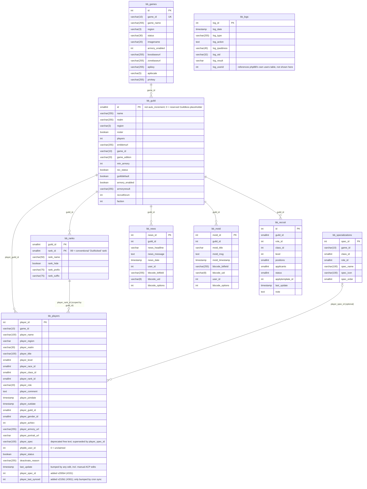
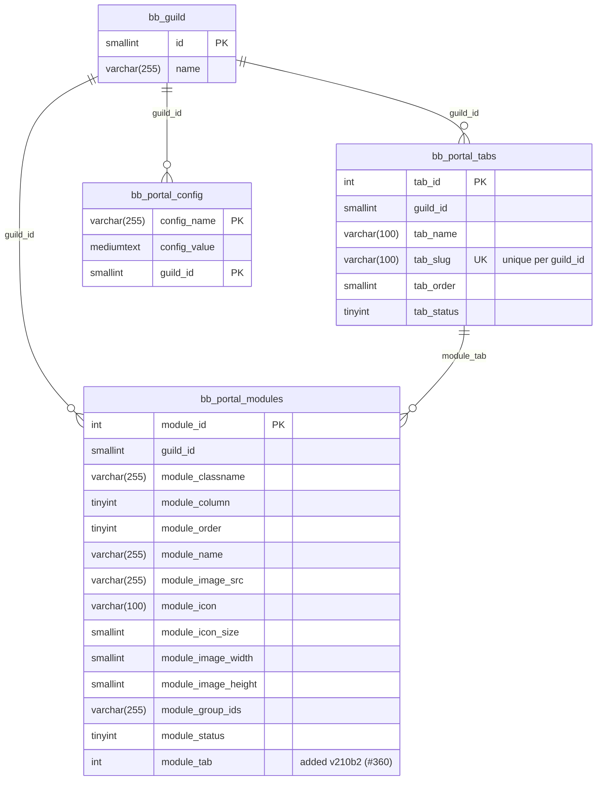
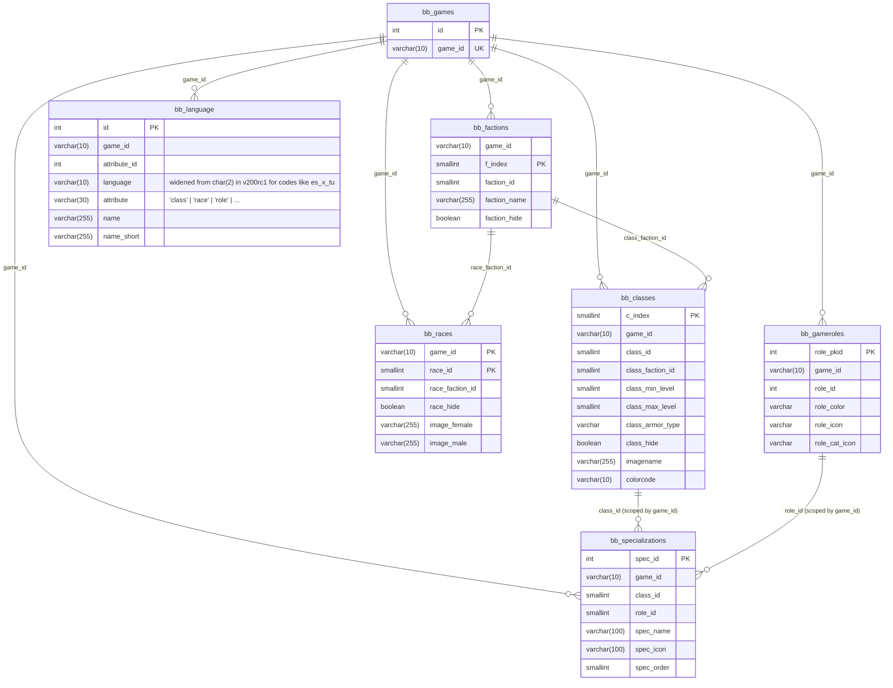

# bbGuild — Database Schema

This documents the **core** bbGuild database schema only — the 17 tables
created by the migrations under `migrations/` in this repository. It does
**not** cover game-plugin tables: achievement tracking
(`bb_achievement`, `bb_achievement_track`, `bb_achievement_criteria`,
`bb_achievement_rewards`, `bb_relations_table`, `bb_criteria_track`),
character equipment (`bb_player_equipment`), and similar tables are created
by `bbguildwow`'s (and other game plugins') own migrations in their own
repositories, not here.

This replaces the previous `database.html`, a SQLEditor-generated dump that
had gone stale: it still documented AION-era columns on `bb_guild`
(`aion_legion_id`, `aion_server_id`, `battlegroup`) removed years ago, and it
listed the achievement tables above as if they were core — they never have
been since the game-plugin split. `database.html` has been deleted; the
schema below was derived directly from the `update_schema()` method of every
migration, in dependency order:

`v200b3` → `v200b4` → `v200rc1` → `v200rc2` → `v200rc4` → `v210b1` → `v210b2`

(`v210b3` is data-only — it re-seeds the default portal template — and made
no schema change.)

**Important caveats:**
- phpBB migrations don't declare database-level `FOREIGN KEY` constraints.
  Every relationship shown below is enforced only by application code
  (joins in `model/player/*.php`, `portal/*.php`, etc.), not by the database
  itself.
- Column types below are simplified to common SQL-ish names for readability
  in Mermaid. They're derived directly from phpBB's own migration type
  tokens: `UINT`/`USINT` → `int`/`smallint` (both unsigned in practice),
  `TINT:N` → `tinyint`, `BOOL` → `boolean`, `VCHAR:N`/`VCHAR_UNI:N` →
  `varchar(N)` (`VCHAR_UNI` with no explicit length defaults to 255),
  `TEXT_UNI` → `text`, `MTEXT` → `mediumtext`, `TIMESTAMP` → `timestamp`,
  `CHAR:N` → `char(N)`.
- Two tables referenced by DI parameters in `config/tables.yml` —
  `bb_bosstable` and `bb_zonetable` — are **not created by any migration
  yet**. Schema is still TBD, so they're omitted from the diagrams below.

## Table-count discrepancy (resolved)

`CLAUDE.md` currently says "16 tables in core" and lists 9 Core + 2 Portal +
5 Game Content = 16. That count is stale by one table: migration `v210b2`
(`add_portal_tabs.php`, shipping #360 on 2026-09-13) added `bb_portal_tabs`,
which brings Portal to 3 tables and the true current total to **17**. The
16-table figure was accurate before `v210b2` merged; `CLAUDE.md`'s Database
Tables section just hasn't been updated since. This document reflects the
current, correct count of 17.

---

## Diagram 1 — Core guild & player

The guild/rank/player/character backbone, plus the guild-scoped content
tables (news, MOTD, recruitment) and the specialization system (#331).
`bb_logs` is included for completeness but has no guild-scoped relationship
— it's a global activity log keyed by `log_userid`, which points at phpBB's
own `users` table, outside this schema.

## Diagram 2 — Portal

The page-level tab system (#360, `v210b2`) sits above the pre-existing
column/module layout engine: a guild has one or more tabs, and each portal
module belongs to exactly one tab (`module_tab`), which in turn scopes its
column/order position. `bb_guild` is repeated here (PK + name only) purely
to anchor the relationship lines — see Diagram 1 for its full column list.

## Diagram 3 — Game content reference data

Per-game lookup tables (classes, races, factions, roles) plus the
localisation table (`bb_language`) that supplies display names for all of
them. `bb_specializations` bridges this diagram and Diagram 1 — it's
counted under "Core" in `CLAUDE.md`'s bucketing (it's player-facing state,
not static reference data) but its `class_id`/`role_id` columns tie it
directly into this subsystem, so it's shown here too. `bb_games` is
repeated (PK + game_id only) to anchor the relationship lines.

---

## Notes on non-obvious columns

- **`player_spec` vs. `player_spec_id`** — `bb_players` carries both the
  legacy free-text `player_spec` column and the structured `player_spec_id`
  FK added in `v200b4` (#331). Migrating existing free-text values into the
  structured column is tracked as #331 Phase 5 and hadn't started as of
  2.1.0-b1.
- **`last_update` vs. `player_last_synced`** — `last_update` is bumped by
  *any* edit, including a manual ACP change. `player_last_synced` (added
  `v210b1`, #361) is bumped only by the character-sync cron task, so a
  manual edit can't make a genuinely stale character look freshly synced.
- **`bb_guild.id` and `bb_ranks`'s composite PK are not auto-increment** —
  guild and rank IDs are assigned explicitly by installer/ACP code.
  `guild_id = 0` is a reserved "Guildless" placeholder; `rank_id = 99` is
  the conventional "Out" (kicked) rank.
- **`bb_portal_modules.guild_col_order` index** changed shape in `v210b2`:
  it was `(guild_id, module_column, module_order)` before #360 and became
  `(guild_id, module_tab, module_column, module_order)` after, matching the
  new tab scoping.
- **`bb_language`** is a generic localisation table, not a strict
  one-entity-per-row FK target — the same table supplies names for classes,
  races, roles, and other attributes, disambiguated by the `attribute`
  column plus the `(game_id, attribute_id, language, attribute)` unique key.
